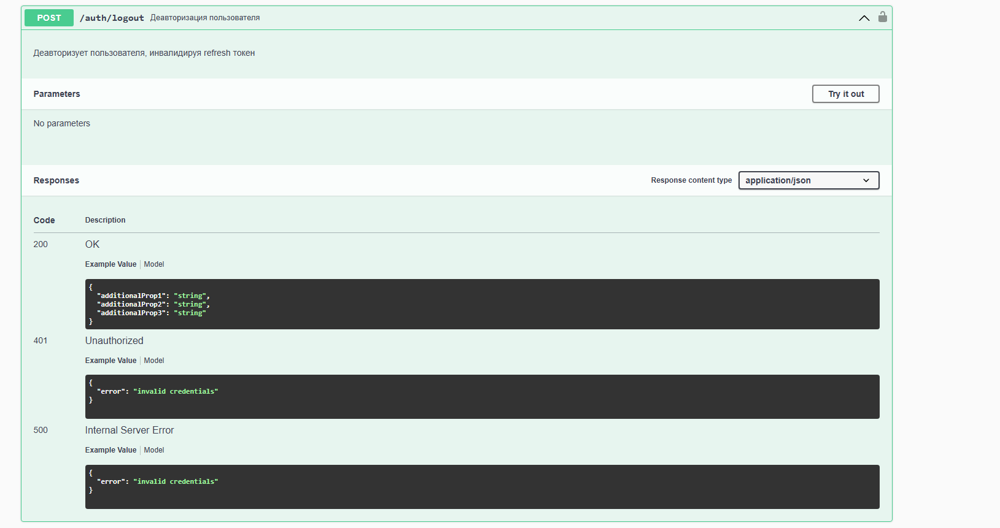
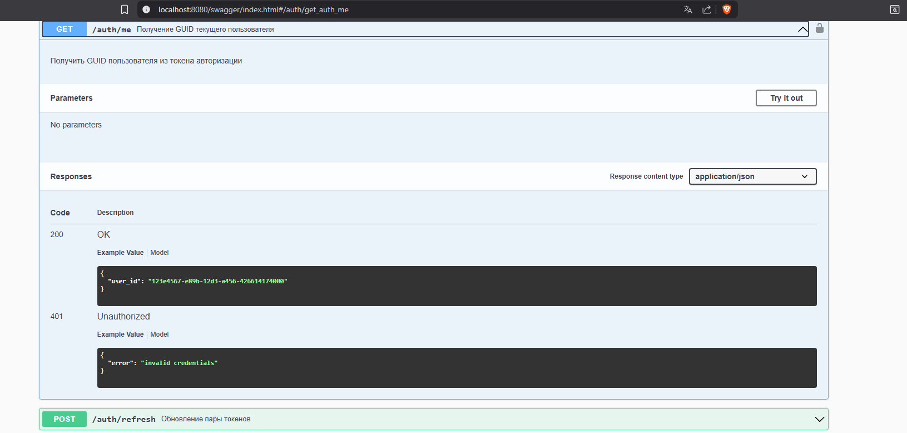
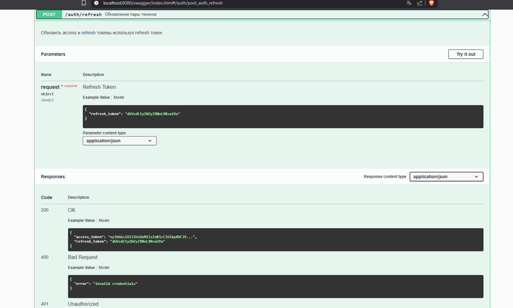
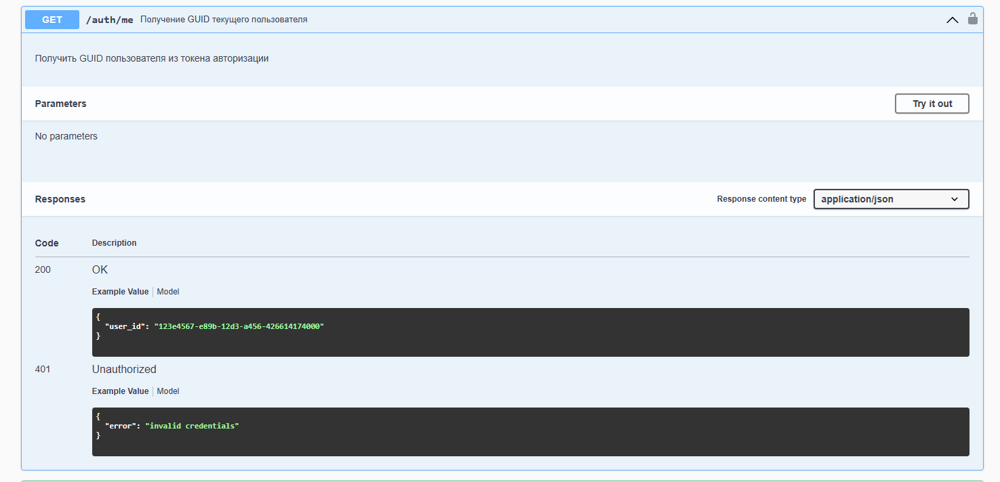
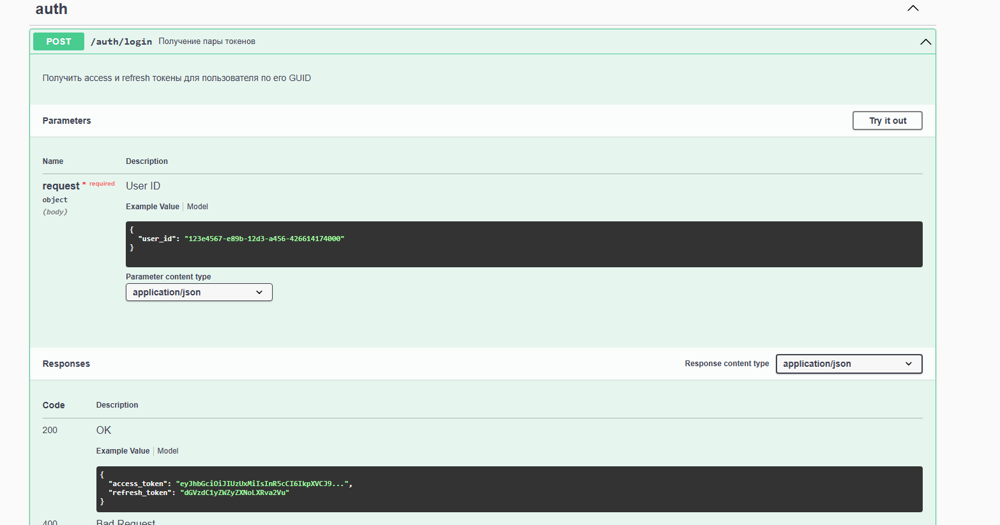

# Auth Service

Сервис аутентификации с JWT токенами, реализующий требования по безопасности для access и refresh токенов.

## Функциональность

- **Получение пары токенов** по GUID пользователя
- **Обновление пары токенов** с защитой от повторного использования
- **Получение GUID пользователя** (защищенный endpoint)
- **Деавторизация пользователя** с инвалидацией токенов

## Требования безопасности

### Access Token
- Формат: JWT
- Алгоритм подписи: SHA512
- Не хранится в базе данных
- Короткое время жизни (15 минут по умолчанию)

### Refresh Token
- Произвольный формат (base64)
- Хранится в базе в виде bcrypt хеша
- Защищен от повторного использования (одноразовый)
- Защищен от изменений клиентом

### Операция Refresh
- Работает только с парными токенами
- Блокирует обновление при изменении User-Agent
- Отправляет webhook при изменении IP
- Автоматически деавторизует при подозрительной активности

## Примеры работы API (Swagger UI)

### Общий вид интерфейса



### Получение access и refresh токенов



### Обновление пары токенов



### Получение GUID пользователя



### Деавторизация пользователя



## Развертывание

### Требования
- Docker
- Docker Compose

### Запуск
```bash
docker-compose up -d
```
